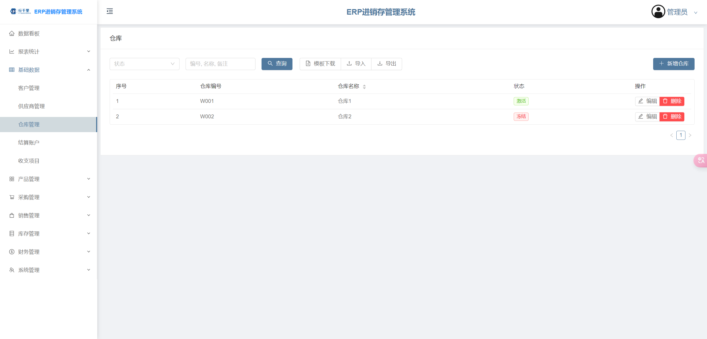
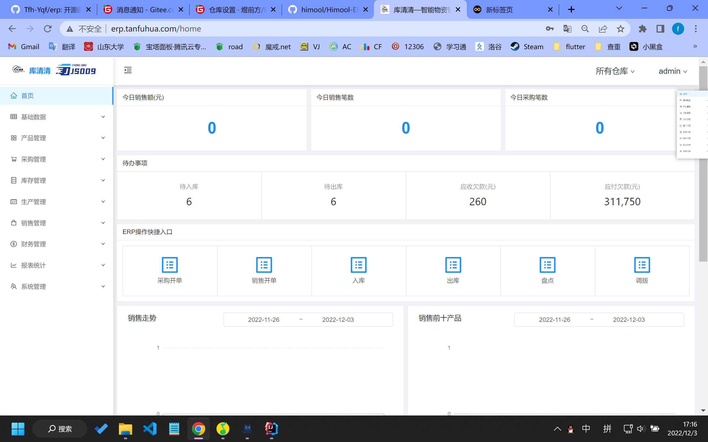
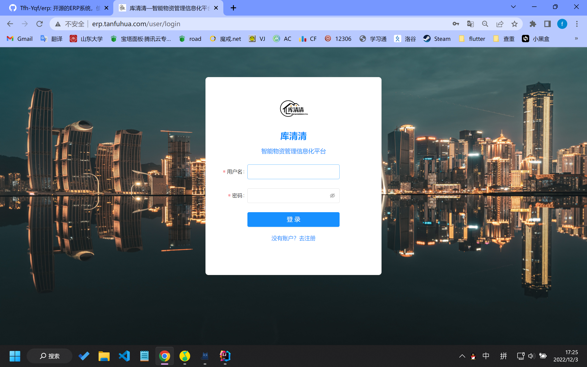
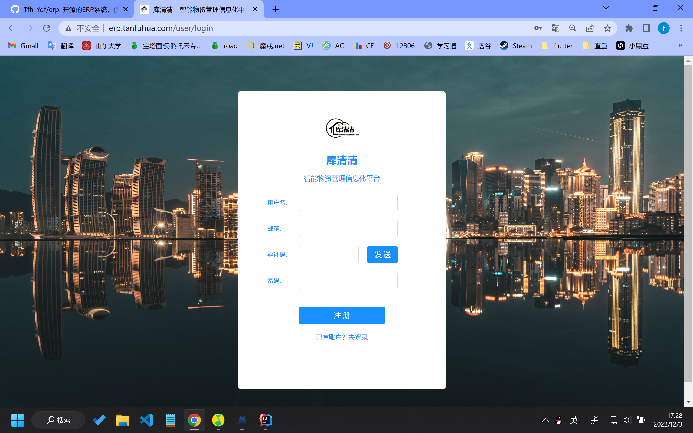

## ERP管理系统-代码运行说明
* 开源的ERP系统，使用django+vue搭建，目前demo搭建在[erp.tanfuhua.com](https://erp.tanfuhua.com)上
* 有产品管理、采购管理、生成管理、销售管理、财务管理、报表统计、系统管理板块，包含不同权限，覆盖绝大部分ERP的场景
* [erp.tanfuhua.com](https://erp.tanfuhua.com)（用户名：管理员，密码：123456）

## 开发环境要求
* Python版本为V3.9+ （推荐使用conda控制版本）
* Django版本为V3.2+
* nodejs 为 12.13.1（推荐使用nvm 控制版本）
* 数据库为MySQL 8.0+

## 快捷部署-docker

~~~
docker-compose up --build
~~~
访问 127.0.0.1:8080查看效果

## 本地运行流程

### 前端运行 nodejs 为 12.13.1

~~~
# 安装yarn
npm install yarn
# yarn安装依赖包
yarn install
# 在utils/config.js里设置自己的后端地址-baseUrl
# 前端 运行
yarn serve
~~~

#### 修改ProjectName
~~~
# 在frontend\src\main.js里可以修改ProjectName和OnwerName为你自己的项目名称
~~~

### 后端运行

~~~
# 切换python环境
conda activate erp
# 安装依赖包
pip install -i https://pypi.tuna.tsinghua.edu.cn/simple -r requirements.txt
# 运行
python manage.py runserver
~~~

### 数据库设置

1. 数据库字符集设置为 utf8mb4
2. 创建 erp-db 数据库(先设置字符集, 再创建数据库)
    CREATE DATABASE erp_db;
3. configs/django.py里修改password,user,host，port（你的ip）字段
4. 迁移数据库
    * python manage.py makemigrations
    * python manage.py migrate
5. 创建管理员用户（编号请输入为2）
    * python manage.py runscript create_user
6. 初始化样例数据（可选）
    * python manage.py runscript create_test_data
7. 初始化权限数据（可选）
    * python manage.py runscript init_permission

## 服务器部署流程（前端使用nginx，后端使用uwsgi）

### 后端部署
1. 配置 uwsgi
    pip install uwsgi
2. 运行 uwsgi
    uwsgi --ini [项目路径]/configs/uwsgi.ini

#### uwsgi配置文件
~~~
[uwsgi]
master = true
processes = 1
threads = 2
chdir = /www/wwwroot/erp.tanfuhua.com
wsgi-file= /www/wwwroot/erp.tanfuhua.com/project/wsgi.py
http = 0.0.0.0:8000
logto = /www/wwwroot/erp.tanfuhua.com/logs/error.log
chmod-socket = 660
vacuum = true
master = true
uid=root
gid=root
max-requests = 1000
~~~

### 前端部署

1. 配置 nginx(配置文件在 /configs/nginx)
2. 构建前端文件
   进入 frontend 目录, yarn build
3. 将dist文件上传至服务器(nginx里配置的目录)

#### nginx配置参数
~~~
server
{
    listen 80;
	listen 443 ssl http2;
    server_name 【域名地址】;
    root 【dist文件存放路径】;
    index  index.html index.htm;

    

    #SSL-START SSL相关配置，请勿删除或修改下一行带注释的404规则
    #error_page 404/404.html;
    ssl_certificate    /www/server/panel/vhost/cert/erp.tanfuhua.com/fullchain.pem;
    ssl_certificate_key    /www/server/panel/vhost/cert/erp.tanfuhua.com/privkey.pem;
    ssl_protocols TLSv1.1 TLSv1.2 TLSv1.3;
    ssl_ciphers EECDH+CHACHA20:EECDH+CHACHA20-draft:EECDH+AES128:RSA+AES128:EECDH+AES256:RSA+AES256:EECDH+3DES:RSA+3DES:!MD5;
    ssl_prefer_server_ciphers on;
    ssl_session_cache shared:SSL:10m;
    ssl_session_timeout 10m;
    add_header Strict-Transport-Security "max-age=31536000";
    error_page 497  https://$host$request_uri;

    #SSL-END

    #ERROR-PAGE-START  错误页配置，可以注释、删除或修改
    #error_page 404 /404.html;
    #error_page 502 /502.html;
    #ERROR-PAGE-END

    #PHP-INFO-START  PHP引用配置，可以注释或修改
    include enable-php-73.conf;
    #PHP-INFO-END

    #REWRITE-START URL重写规则引用,修改后将导致面板设置的伪静态规则失效
    include /www/server/panel/vhost/rewrite/erp.tanfuhua.com.conf;
    #REWRITE-END

    #禁止访问的文件或目录
    location ~ ^/(\.user.ini|\.htaccess|\.git|\.svn|\.project|LICENSE|README.md)
    {
        return 404;
    }

    #一键申请SSL证书验证目录相关设置
    location ~ \.well-known{
        allow all;
    }

    location ~ .*\.(gif|jpg|jpeg|png|bmp|swf)$
    {
        expires      30d;
        error_log /dev/null;
        access_log /dev/null;
    }
    
  	location /api/ {
  		proxy_pass http://localhost:【后端运行端口地址】/api/;
  		proxy_set_header Host $http_host;
  		proxy_set_header X-Forwarded-Proto $scheme;
  	}

    location ~ .*\.(js|css)?$
    {
        expires      12h;
        error_log /dev/null;
        access_log /dev/null;
    }
    access_log  【日志文件存放地址】;
    error_log  【日志文件存放地址】;
}
~~~

### 数据库部署流程同本地部署流程一致（注意确保configs/django.py里的数据库配置正确）

### 界面截图
首页

报表

产品

采购

销售

生产

库存

财务

设置

登录板块

注册板块

首页板块

产品板块

采购管理

生产管理

销售管理

财务管理

报表统计

系统管理
